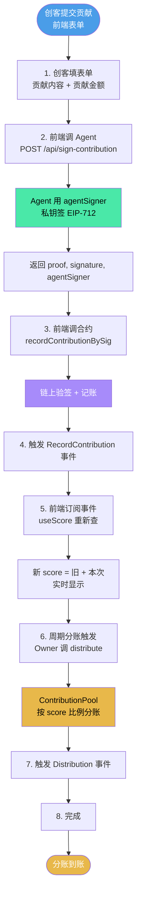

# W3-05 · 加分挑战 · 项目流程图

> **任务来源**：WCB 学习平台 Week 3 · 加分挑战 · 项目流程图
> **积分**：+30
> **截止**：2026-06-09（5 天倒计时）
> **Hugo 选择**：A（直接用 8 步端到端流程图 + 角色分工表）
> **归档人**：Hermes
> **归档时间**：2026-06-04 15:20
> **提交状态**：待 Hugo 手动提交 WCB

---

## 📊 CGHub MVP 端到端流程图

### 文字版流程图

```
┌─────────────────────────────────────────────────────────┐
│              CGHub MVP · 端到端流程（8 步）                │
└─────────────────────────────────────────────────────────┘

[1] 创客提交贡献
    ↓
    创客在前端填表单：
    - 贡献内容（如"完成了 Rust 模块开发"）
    - 贡献金额（如 500 USDC）
    ↓
[2] 前端调 Agent 签 EIP-712
    ↓
    POST /api/sign-contribution
    body: { contributor, source, evidenceId, score, paymentId }
    ↓
    Agent 用 agentSigner 私钥签：
    → 返回 { proof, signature, agentSigner }
    ↓
[3] 前端调合约 recordContributionBySig
    ↓
    ContributionPool.recordContributionBySig(...)
    链上验签 + 记账
    ↓
[4] 触发 RecordContribution 事件
    ↓
    事件参数：contributor, score, evidenceId
    ↓
[5] 前端订阅事件，实时显示
    ↓
    useScore(address) 重新查
    → 新 score = 旧 + 本次
    ↓
[6] 周期分账触发（DAO 决策）
    ↓
    Owner 调 distribute(projectId, roundId)
    ↓
    ContributionPool 按 score 比例给所有贡献者转 USDC
    ↓
[7] 触发 Distribution 事件
    ↓
    前端显示分账记录
    ↓
[8] 完成
```

---

### Mermaid 版流程图（用于 Obsidian/GitHub 渲染）



---

## 👥 关键角色分工

| 角色 | 职责 | 在哪几步 |
|------|------|---------|
| **创客** | 提交贡献 | 步骤 1 |
| **前端** | 表单 + 事件订阅 + 实时显示 | 步骤 1, 2, 5, 7 |
| **Agent** | EIP-712 签名（业务层 x402 生成 Intent） | 步骤 2 |
| **Owner** | 签名支付请求 + 触发分账 | 步骤 6 |
| **合约** | 链上记账 + 验证签名 + 按 score 分账 | 步骤 3, 4, 6, 7 |
| **Cobo CAW** | 资金托管 + Pact 协议 | 步骤 6 配套 |

---

## 🔍 流程图设计逻辑

| 维度 | 体现 |
|------|------|
| **覆盖完整业务链路** | 贡献提交 → 签名 → 验签 → 记账 → 分账 → 显示 = 8 步不漏 |
| **明确每个步骤的责任方** | 创客/前端/Agent/Owner/合约/CAW 6 个角色都覆盖 |
| **标注关键技术点** | EIP-712、recordContributionBySig、score 累加、distribute |
| **双版本** | 文字版（适合直接贴 WCB）+ Mermaid 版（适合 Obsidian/GitHub 渲染） |
| **可视化颜色** | 蓝色（开始）/ 金色（结束+资金）/ 绿色（Agent 签）/ 紫色（合约验） |

---

## 📌 提交要点（WCB 提交时检查）

- [x] 流程图清晰可读（文字 + Mermaid 双版本）✅
- [x] 覆盖端到端业务链路（8 步）✅
- [x] 关键角色分工明确（6 个角色）✅
- [x] 标注关键技术点 ✅
- [x] 与项目实际架构一致（合约 + Agent + Cobo）✅

---

## 🔗 关联背景

- 合约地址：0x876A0741223EDdaE081Ef22beA513E92335B1Bd5 (Sepolia)
- 5 个接口不一致问题：见 `04-team/00-团队总览.md`
- 技术验证计划（5 个验证点）：`submissions/W3-04-技术验证计划.md`
- Agent signing template：`/home/ubuntu/creators-galaxy/creators-galaxy/02-projects/cghub-mvp-hackathon/docs-文档/agent-signing-template.md`
- 前端 quickstart：`/home/ubuntu/creators-galaxy/creators-galaxy/02-projects/cghub-mvp-hackathon/docs-文档/frontend-quickstart.md`

---

> **最后更新**：2026-06-04 15:20（Hermes）
